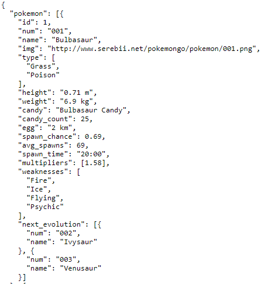
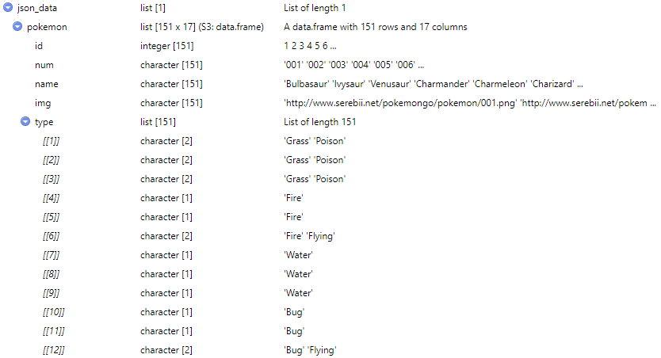
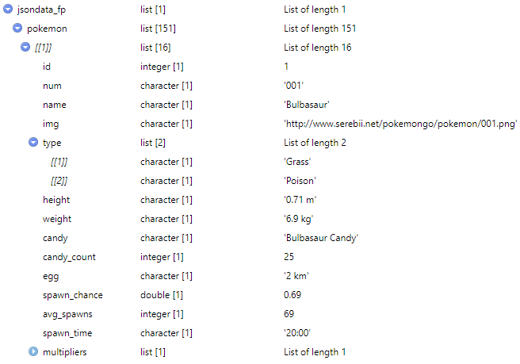

# What is JSON data type?
*JavaScript Object Notation* (JSON) are human and machine readable formats for structuring data from the web. Its primary use is to transmit data consisting of attributes between a server and web application. JSON is an ideal data-interchanging language for using conventions familiar to languages such as C++, Java, Python, etc. and its text format that is language independent. 

JSON is built on two structures that is supported in modern programming - *object* and *array*. 

An *object* is an unordered set of name/value beginning and ending with left and right braces `{}`. Names are listed before `:` and values follow. Each name are separated by `,`. 

An *array* is a collection of values beginning and ending with brackets `[]` and separated by `,`.

To further understand this, let's look at an example:  
```{r, out.width="300px",echo=FALSE, warning=FALSE, message=FALSE}
require(knitr)

```

In this example, the first level name is "pokemon". "pokemon" contains an object array that lists second level names and its respective values: "id":1, "num": "001", "name": "Bulbasaur",...

Pretty simple, right?

# Importing/using JSON in R
Now that we have a pretty good idea on JSON formatted data, let's go into how to get R to parse it.  
There are 3 main packages available in R for JSON formatted data: **rjson**, **RJSONIO**, and **jsonlite**.  

The [**rjson**](https://www.rdocumentation.org/packages/rjson/versions/0.2.20) package is mainly for converting R objects to JSON objects and vice-versa and the functions that exists in the package does just that. 

The [**RJSONIO**](https://cran.r-project.org/web/packages/RJSONIO/RJSONIO.pdf) package is a slower, but more integrated version of the **rjson** package to customize and process JSON files with the intent to support project development by building and providing feedbacks and benefits.

The [**jsonlite.**](https://cran.r-project.org/web/packages/jsonlite/index.html) package is a powerful tool for building pipelines to interact with web API, stream, validate, and customize JSON data by recognizing and complying with conventional ways of encoding data in JSON. 

Overall, all three packages can fulfill the purpose of this vignette, its just a matter of efficiency. Thus, in this vignette, we will focus on the **jsonlite** package to parse a JSON data file.  

### Data

**jsonlite* will be used to parse the JSON data structure example from above. The JSON data file contains Pokemon data from the Pokemon Indigo League. The JSON data was obtained from the [*gaming section*](https://github.com/jdorfman/awesome-json-datasets#gaming) of a GitHub repository.

The file consist of 17 variables of the 151 major pokemon featured from the recent Nitendo game **POKEMON GO** - *pokemon type*, *height*, *weight*, *spawn chance*, *average spawn*, *etc.* 

To read this JSON data, let's install the *jsonlite* package.
```{r, echo=TRUE, eval=FALSE, message=FALSE, warning=FALSE}
# Installing jsonlite
install.packages("jsonlite",repos = "http://cran.us.r-project.org")
```

In this package, the [`fromJSON`](https://www.rdocumentation.org/packages/jsonlite/versions/1.6/topics/toJSON%2C%20fromJSON) function will parse and structure the data into R objects we are familiar with. The function offers multiple options.  
Below is a list of a few of the options:  

`simplifyVector`: forces JSON arrays to atomic vector  
`simplifyDataFrame`: forces JSON arrays containing objects/values into a data frame  
`simplifyMatrix`: forces JSON arrays of equal mode and dimension into matrices  
`flatten`: unnest data frame  
`pretty`: adds whitespace to the output

```{r, echo=TRUE, message=FALSE, warning=FALSE}
# Loads the package
require(jsonlite)

# r web / r json - get json data from url
jsondata_txt<- fromJSON(txt="https://raw.githubusercontent.com/Biuni/PokemonGO-Pokedex/master/pokedex.json")
```

Applying the fromJSON function with only the `txt` option, the data are parsed into an R object - in this case, a dataframe named *Pokemon*! 

```{r, echo=FALSE, message=FALSE, warning=FALSE}
require(knitr)

```

In reference to our example above about JSON data structure, we can now see how the raw JSON structure was parsed to create this dataframe. The first-level name "pokemon" is our table containing the second-level names - "id", "num", "name", ..., "prev_evolution" - as the columns.

Let's try applying the `flatten` option, to see how it will change the the JSON file read in to R.

```{r}
jsondata_fp<- fromJSON(txt="https://raw.githubusercontent.com/Biuni/PokemonGO-Pokedex/master/pokedex.json", flatten=TRUE)
```

The `flatten` option created a differently structure R object of the above - each observation are listed. Might not be that useful, unless you want to look at each row individually.

```{r, echo=FALSE, message=FALSE, warning=FALSE}
require(knitr)

```

The `txt` option is sufficient to importing JSON data to R. Structure related concerns can be manipulated later with other packages that serves that purpose.

```{r, echo=FALSE, message=FALSE, warning=FALSE}
require(knitr)

pokemon<- jsondata_txt$pokemon

knitr::kable(head(pokemon), caption="Preview of Pokemon")
```

Now with this, we can do our regular data frame manipulations, variable creations, or formatting. So, let's do just that!

```{r, echo=TRUE, message=FALSE, warning=FALSE}
#Call in some Tidyverse packages
library(stringr)
library(tidyr)
library(plyr)
library(dplyr)

#Function to convert KG to LBS
#Height and Weight are predefined as meters and kilograms
kg_to_lb <- function(x) {
  lb=(2.20462*x)
  return(lb)
}

#Function to convert meters to inches
m_to_in <- function(x) {
  inches<- (39.3701*x)
  return(inches)
}

# Function to calculate and create BMI
create_BMI <- function(x,x2) {
  BMI <- (as.numeric(x)*703)/as.numeric(x2)^2
  return(BMI)
}


#Filter data frame to uni-type pokemons
pokemon<- jsondata_txt$pokemon %>% filter(type=="Normal" | type=="Fire" | type=="Water" | type=="Bug" | type=="Poison" | type=="Electric" | type=="Ground" | type=="Fighting" | type=="Physic" | type=="Dragon") 

#Re-create the weight column - gets rid of the unit and convert to pounds
pokemon1 <- pokemon %>% mutate(Weight=kg_to_lb(as.numeric(gsub("[a-zA-Z ]", "", pokemon$weight)))) 

#Re-create the height column - gets rid of the unit and convert to inches
pokemon2 <- pokemon1 %>% mutate(Height=m_to_in(as.numeric(gsub("[a-zA-Z ]", "", pokemon$height)))) 

#Gets rid of unecessary columns and create BMI
pokemon3 <- pokemon2 %>% mutate(BMI=create_BMI(x=Weight,x2=Height)) %>% select(name, type, Height, Weight, BMI, candy, candy_count, egg, spawn_chance, avg_spawns, weaknesses) 

#Unlist pokemon type
pokemon4 <- as.data.frame(transform(pokemon3,Type=unlist(pokemon$type))) %>% select(name, Type, Height, Weight, BMI, candy, candy_count, egg, spawn_chance, avg_spawns, weaknesses) 

```

```{r, echo=FALSE, message=FALSE, warning=FALSE}
kable(head(pokemon4), caption="New changes made to the data")
```

## Basic Exploratory Analysis

Let's explore into this data. First, let's check some frequency.

```{r, echo=FALSE, message=FALSE, warning=FALSE}
kable(table(pokemon4$Type),caption="Uni-Type Pokemons", col.names = c("Pokemon Type","Frequency"))
```

Obviously, during the first Pokemon season, Normal and Water type were the most abundant. In the following tables, the difference in these types can be seen by height and weight. 

```{r, echo=FALSE, message=FALSE, warning=FALSE}
ifun <- function(x,y,...) {
    return(summary(x))
}

fire<- pokemon4 %>% filter(Type=="Fire") %>% select(Height, Weight, BMI)
kable(sapply(fire,ifun),caption="Summary of Fire Type Pokemon")

water<- pokemon4 %>% filter(Type=="Water") %>% select(Height, Weight, BMI)
kable(sapply(water,ifun),caption="Summary of Water Type Pokemon")

dragon<- pokemon4 %>% filter(Type=="Dragon") %>% select(Height, Weight, BMI)
kable(sapply(dragon,ifun),caption="Summary of Dragon Type Pokemon")

bug<- pokemon4 %>% filter(Type=="Bug") %>% select(Height, Weight, BMI)
kable(sapply(bug,ifun),caption="Summary of Bug Type Pokemon")

Normal<- pokemon4 %>% filter(Type=="Normal") %>% select(Height, Weight, BMI)
kable(sapply(Normal,ifun),caption="Summary of Normal Type Pokemon")

Poison<- pokemon4 %>% filter(Type=="Poison") %>% select(Height, Weight, BMI)
kable(sapply(Poison,ifun),caption="Summary of Poison Type Pokemon")

Electric<- pokemon4 %>% filter(Type=="Electric") %>% select(Height, Weight, BMI)
kable(sapply(Electric,ifun),caption="Summary of Electric Type Pokemon")

Ground<- pokemon4 %>% filter(Type=="Ground") %>% select(Height, Weight, BMI)
kable(sapply(Ground,ifun),caption="Summary of Ground Type Pokemon")

Fighting<- pokemon4 %>% filter(Type=="Fighting") %>% select(Height, Weight, BMI)
kable(sapply(Fighting,ifun),caption="Summary of Fighting Type Pokemon")
```


### Visuals  

Using a scatterplot, it shows that Poison types has the greatest Height range and Fire types has the steepest slope for their heights vs weights.

```{r, echo=FALSE, message=FALSE, warning=FALSE}
require(tidyverse)
p2 <- ggplot(pokemon4,aes(x=Height,y=Weight))
p2 + geom_point(aes(col=Type)) + geom_smooth(method=lm, col="Green", aes(group=Type))
```

Here is a nice histogram of BMI that is slightly right skewed due to one or some outliers - may be the normal types?

```{r, echo=FALSE, message=FALSE, warning=FALSE}
g1 <- ggplot(data= pokemon4 ,aes(x=BMI))
g1 + geom_histogram(aes(y=..density..)) + geom_density(color="red",line=2)
```

The boxplot might have the best visual to comparing each types' BMI. It seems the creater/designers tried balancing each type, except for the dragon types (which there is enough of them in the first season to conclude anything.)

```{r, echo=FALSE, message=FALSE, warning=FALSE}
g2<- ggplot(pokemon4,aes(x=Type,y=BMI))
g2+geom_boxplot(fill="white") +geom_point(aes(col=Type),size=1,position="jitter")
```


